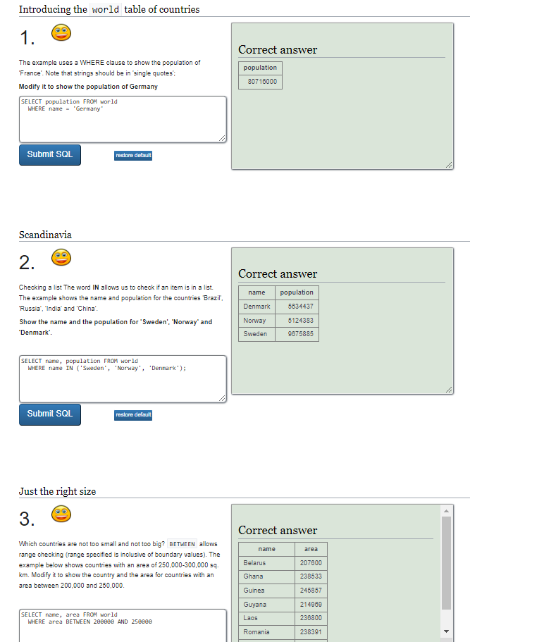
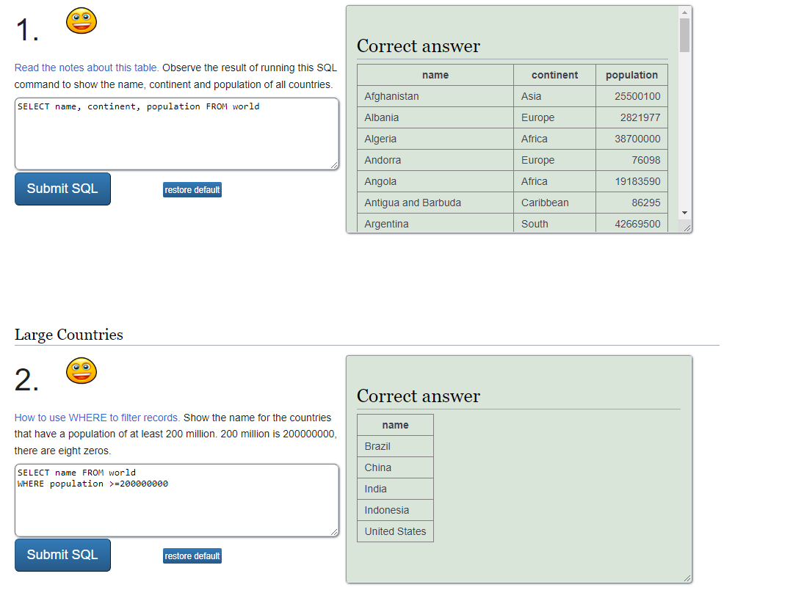

# Webbed 
### By ayush ghimire

## Owasp top 10

### Broken Access control - 01
--- Description - access control enforces policy that users cannot act of outside of their intended permissions.Some of these includes Api unthuorized access due to CORS configurations, giving consent to someboady else account by giving unique id ,maniplating JSON web token access control token or a cookie, bypassing access control checks by modifying the URl, acting as user without logging as a user, and manipulating metadata.

--- How to prevent - To prevent the Access Control Every developer should Rate limit API and controller access to minimize the harm from automated attack tooling, disable web server directory listing and ensure file metadata, are not present within the web, the model layer should put a record ownership rather than giving permission for any CRUD operatons, there should be a short timespan for the JWt token so that the attacker can not manipulate , alerting on a inappropriate access by logging all the failures attempt.

### Security Misconfiurations - 05
---  Descriptions - About 90% of the applications have security failures due to unnessary features are enabled, the frameworks like nodejs  ASP.net etc can not secure the security settings, the software is out of the date or vulnerable, improper configured permissions on cloud services .
--- How to prevent - a repeatable hardening process make the secure environment by putting different credenetials in each develpoment , Qa , and production environemnts, Uncessary features, components , documnetation should not be install or should be removed, and a automated process to verify the right configurations and settings in all environmentss.

### Vulnerable and Outdated Components - 06
--- Descriptions- Vulnerable components are a known issue that a user have to test and assess risk, you are likely vulnerable if you do not know the versions of both the client and server-side, if the software is still vulnerable, or unsupported, or out of date, if you do not regularly scan for the vulnerabilities, if we do not secure the componets vulnerabilities. 

--- How to prevent - it can be prevented by removing the unused dependencies , unnecessary features, components , files and documentation, Continusly monitoring the sources like Owasp dependency check, retire js, etc continously monitoring comman vulnerability and exposures and National vulnerability database(NVD) for vulnerabilities in the Components. Only obtain components from official sources over secure links. 

### Injection - 03
--- Descriptions - Injection has been one of the oldest web security problem , injection is possible due to user-supplied data is not validated , filtered, sanitized by the application, Hostaile data is directly used. Some of the comman injections are SQl, NoSQl, OS Command ,ORM

--- How to prevent - Use Limit amd other SQL Controls within queries to prevent mass disclosure of records in case of SQl injections, using proper server -side input validation.

## SQlZoo
### 0 SELECT basics

2 SELECT from World, from first two subtasks.

