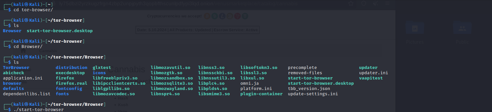
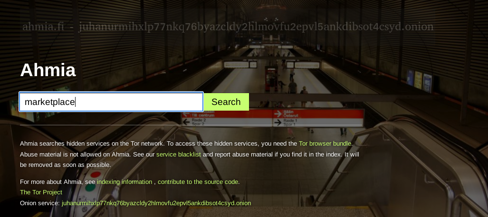
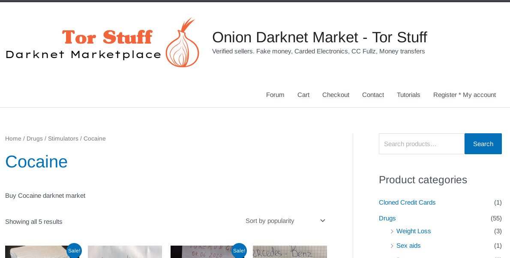
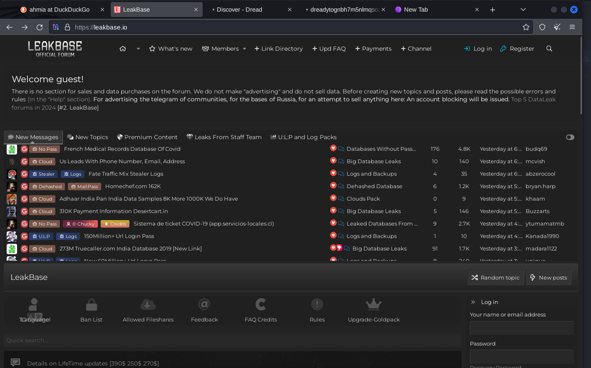

# Dark web 

## x) Read and summarize 
### 7 Things You Should Know About Tor

1. Tor has very robust encryption and algorithms at the crytographic level , but still there are other ways that a hacker can attack tor like side-channel attacks on browser bugs, user misconfigurations,traffic correlation attacks
2. Tor is not use dby the criminals and pedophiles, but they are also used by the activists , military, protecting the children , , journalist.
3. Tor does not have the military backdoor , it has a audited by several very s,art cryptographers and security proffesional , and any programmer can take a look at the code , and verify that there is no fishy going on.
4. Tor is not illegal to use and noone in the USA has been prosecuted for using the TOR, but some people are using it  to do some crime , due it has bas bad influence in the public.
5. Tor is not hard to use , it has a very easiest way to install , and another way to use the TOR is by using the tails.
6. Tor developers have been doing hardworking so that the connection can be very faster , and to speed up the tor anybody can help by creating the delays
7. Tor helps users browse the internet anonymously, but improper use, such as misconfigurations or logging into identifiable services, can compromise privacy. Additionally, traffic correlation attacks can be used by adversaries to identify users despite Tor's encryption.

### Hiding Behind the Keyboard: The Tor Browser 
- This section likely introduces Tor (The Onion Router) as a tool that enables anonymous browsing by routing traffic through multiple layers of encryption. The authors discuss the growing relevance of online anonymity in both positive and negative contexts, covering how Tor provides privacy to users and also discussing its controversial use by criminals to hide their activities. The introduction probably sets the stage by highlighting Tor's role in the broader debate about cybersecurity, privacy rights, and law enforcement challenges in the digital age.

- In this section, the authors trace the origins of Tor, starting with its development by the United States Naval Research Laboratory in the mid-1990s. Originally, Tor was designed to protect government communications and offer a means of secure communication for intelligence agencies. Over time, its use expanded to the public as a tool for online anonymity. The authors might emphasize that while Tor was designed for whistleblowers, activists, and those under oppressive regimes to communicate securely, it is also misused by bad actors to engage in illegal activities like drug trafficking and cybercrime.

- This section dives into the technical mechanics of Tor, explaining its layered encryption process. The term "Onion" comes from the way data is wrapped in layers of encryption at each node (relay) in the network. When a user connects to a website using Tor, their request is routed through several Tor nodes, with each node only knowing the previous and next hops, but never the full path. This process ensures that the origin and destination of the traffic are masked, preventing surveillance or tracking. The authors likely explain how exit nodes (the last node in the chain) work and the inherent challenges and vulnerabilities these nodes present, such as the possibility of exit node eavesdropping.

- Despite Tor's strong anonymity features, "Tracking Criminals Using TOR" explores how law enforcement agencies attempt to track criminals who exploit the network for illicit purposes, such as using the dark web for drug dealing, human trafficking, or other illegal activities. The authors might discuss the techniques used by law enforcement, including traffic analysis, honeypot servers, and legal methods like subpoenaing Internet service providers (ISPs). They also likely touch upon famous cases where criminals were caught, despite using Tor, through methods like exploiting vulnerabilities in browser software or user errors. This section may emphasize the cat-and-mouse game between privacy advocates, cybercriminals, and law enforcement trying to uphold justice.

## a) Intalling the Tor browser
1. Downloading the TOR Browser
  Go to the official TOR Project website. Avoid downloading the browser from unofficial sources to prevent security risks.

2. Extract the TOR Browser Files
  Extract the downloaded file using the following command:

    tar -xf tor-browser-linux64-*.tar.xz

3. Run the TOR Browser
      Navigate into the extracted TOR Browser directory:
       cd tor-browser_en-US/

  Run the TOR Browser using the following command:
    ./start-tor-browser.desktop

4. Connect to the TOR Network
  When the TOR Browser starts, you'll see a window asking if you want to Connect to the TOR network or configure network settings. Click Connect to start browsing the TOR network.

5. Accessing .onion Websites
  Once connected, you can visit .onion websites by typing the address in the TOR Browser’s URL bar. 

## b) Browse TOR network

- Search engine 
      

  There are many serach engine , which includes ahmia, haystick , where Onion sites are “crawled” and added to the list  

- Marketplace
      

  this markeplace includes all of drugs , credit cards , and other things.

- forum 

  

  this is the sites where many leaked information are putted together 

- a site for a well known organization that has a physical street address in the real world
      

  This is onion sites for CIA .

  
